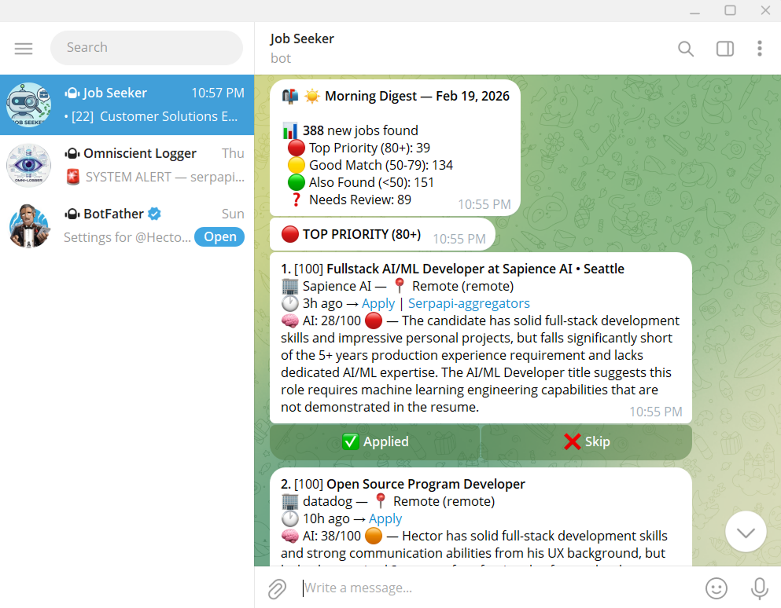

<div align="center">
  <h1>Job Search Nuclear Option</h1>
  <p><b>A Comprehensive Market-Dominance Protocol for Job Acquisition</b></p>

  <p>
    
    <a href="./LICENSE.md"></a>
  </p>

> _Disclaimer: I built this project to automate the tedious aspects of my job search and to solve a real technical problem I was facing. While this tool can handle high-volume applications, my goal was to engineer a solution that showcases my skills in problem-solving, API integration, and OSINT. If you are a recruiter or hiring manager reading this, please view it as a technical portfolio piece, a demonstration of how I approach automation and efficiency rather than a "spray and pray" application strategy. I prioritize genuine interest and targeted applications over sheer volume._

  
  
  <p>
    <a href="#overview--methodology">Overview</a> •
    <a href="#getting-started">Getting Started</a> •
    <a href="./Methodology.md">Methodology</a> •
    <a href="#features">Features</a>
  </p>
</div>

## Overview & Methodology

The contemporary digital labour market is an adversarial environment characterized by information asymmetry. Major platforms act as gatekeepers, introducing propagation delays. **The Nuclear Option** is a fundamental shift in operational doctrine from passive consumption to active Open-Source Intelligence (OSINT) gathering. By bypassing aggregators and interfacing directly with core data sources (ATS, government portals, niche boards), we establish a protocol for total market coverage.

<div align="center">
  <br/>
  <a href="./Methodology.md">
    
  </a>
  <br/><br/>
</div>

## Getting Started

### Prerequisites

Ensure you have the latest stable version of [Bun](https://bun.sh/) installed:

```bash
# Windows (PowerShell)
powershell -c "irm bun.sh/install.ps1 | iex"

# macOS, Linux, WSL
curl -fsSL https://bun.sh/install | bash
```

### Installation

```bash
# Clone the repository
git clone https://github.com/Hector-Ha/JobSearcherPipeline

# Navigate to the project directory
cd jobsearch

# Install dependencies using Bun
bun install
```

### Quick Start

Initialize the complete job search pipeline:

```bash
# Start pipeline workflow (discover -> ingest -> digest -> evaluate)
bun run pipeline.ts
```

## Highlights & Key Features

- **Direct ATS Integration:** Bypass aggregators and index jobs directly from Greenhouse, Lever, Ashby, and more.
- **Enterprise & Sovereign Boards:** Penetrate "Black Box" systems like Workday and local Canadian boards (BambooHR, Collage HR).
- **Government & Public Sector:** Monitor specific "Inventory" and "Pool" postings.
- **Automated Alerts:** Evaluate roles dynamically and score them using local and remote AI models (Ollama, Modal, Anthropic).
- **OSINT-Driven Targeting:** Use advanced recursive search to discover "We are hiring" signals in GitHub repos and private Slack communities.

## Usage & Tooling

The system operates via specific focused workflows, which you can run individually if needed:

```bash
# 1. Discover new job boards recursively from seed data
bun run discover

# 2. Ingest raw job data from known ATS systems
bun run ingest

# 3. Digest and normalize the data
bun run digest

# 4. Filter, score, and evaluate job postings
bun run evaluate
```

## Documentation

For deeper dives into individual components, workflows, and configurations:

- [Methodology Protocol](./Methodology.md) - The overarching strategy.
- [Configuration Reference](./config/README.md) _(Coming soon)_ - How to structure `companies.json` and `sources.json`.

## Contributing

Contributions are what make the open-source community such an amazing place to learn, inspire, and create. Any contributions you make are **greatly appreciated**.

## License

Distributed under the GNU General Public License v3.0. See [`LICENSE.md`](./LICENSE.md) for more information.
